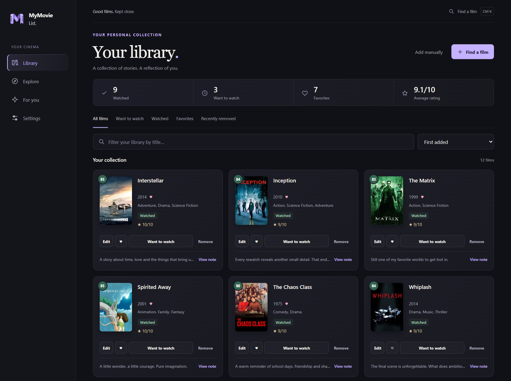
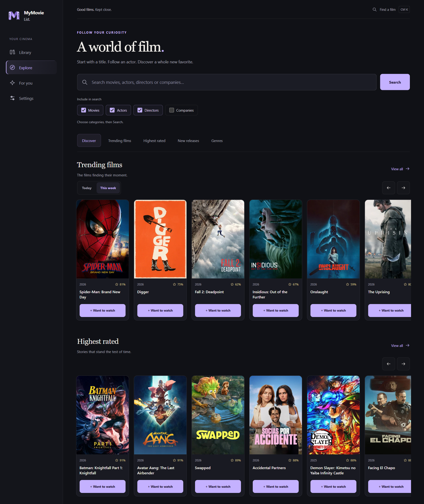
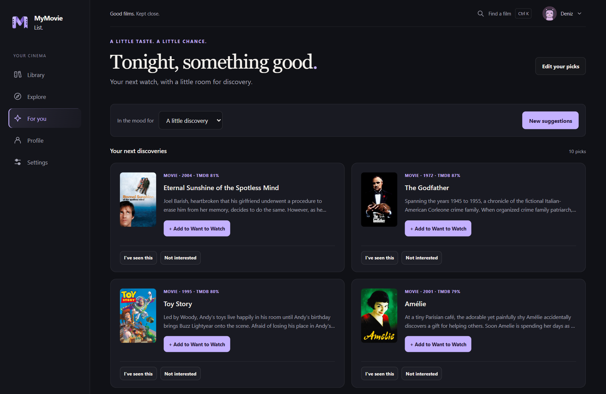
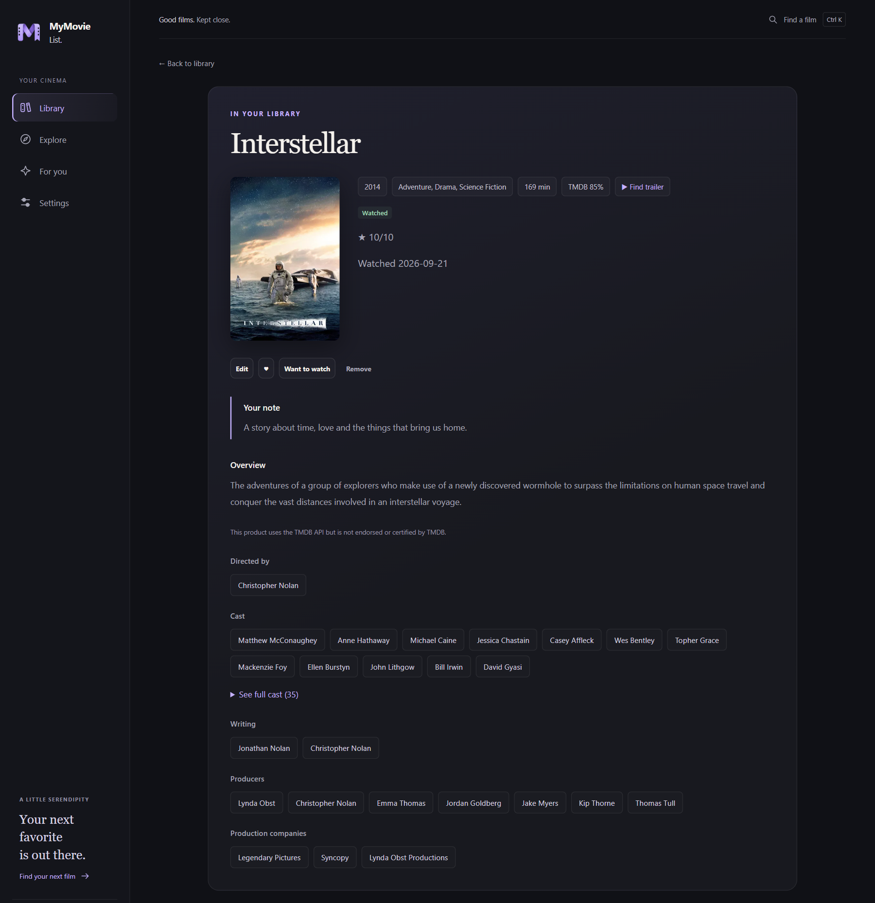
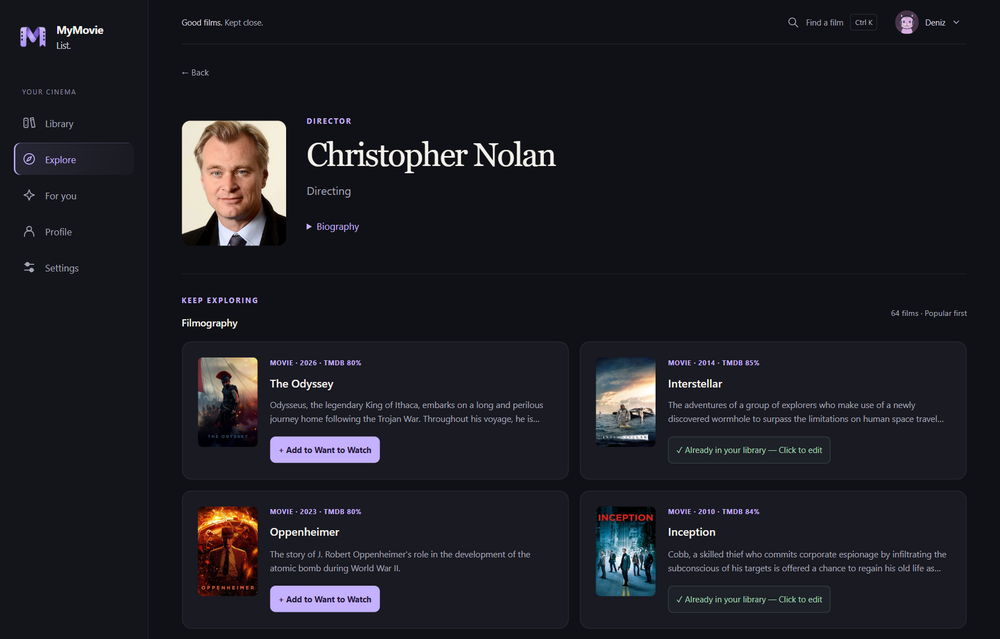
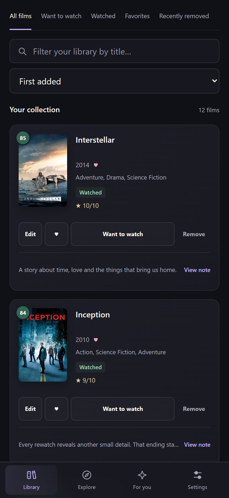
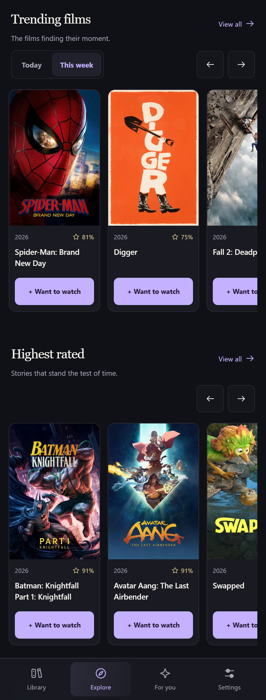

<p align="center">
  
</p>
<h1 align="center">MyMovieList</h1>
<p align="center"><strong>Your films. Your thoughts. Your space.</strong></p>
<p align="center">A personal movie library with discovery, recommendations and a private journal. No account or API key required.</p>
<p align="center"><a href="https://github.com/keremakcn/MyMovieList/releases/latest"><strong>Download</strong></a> · <a href="https://github.com/keremakcn/MyMovieList/releases">All releases</a></p>

**English** | [Türkçe](README.tr.md)

## Get started

**Windows — v3.5.0**

1. Download `MyMovieList-v3.5.0-windows.zip` from the release’s **Assets**.
2. Extract it and open `MyMovieList-v3.5.0.exe`. No Python installation is needed.
3. Search for a film and add it to your library. Discovery is ready without setup.

**Android — 3.5.0 beta.1**

Download `MyMovieList-3.5.0-android-beta.1.apk` from the release’s **Assets** and open it on your phone. Android 7.0 or newer, a 64-bit ARM device and a current Android System WebView are required. The Android app runs independently, keeps your library on the phone and can sync your account library with Windows when you sign in. Accounts remain optional. This is a beta: physical-device testing is still required. See [Android details](ANDROID.md).

## Features

- **English and Turkish interface:** first launch follows your device's UI language (Turkish or English fallback), then remembers your choice locally. Change it in **Settings → Language**. Turkish-original films show their Turkish names, and synopses use available Turkish translations with English fallback. Movie identity and personal notes stay unchanged.
- **Automatic movie details:** cast, directors, writers, producers and studios are saved with each addition. Older entries fill missing details automatically as you browse online; saved details and bilingual synopses remain available offline.
- Track **Want to watch** and **Watched**, with ratings, favorites and private notes.
- Add films directly from search without losing your results.
- Browse **Trending films** by day or week, **Highest rated**, **New releases** and **Genres** in Explore. Open full lists, hide library films and add directly from a poster card.
- Explore actors, directors and production companies, then discover their films.
- Get personal recommendations from your ratings and favorites, using genres, available themes, directors and lead cast. The three discovery modes balance familiar films with new interests; refresh for new picks with fewer recent repeats.
- Recommendations preserve smaller interests and limit repeated themes, franchises and directors. The public movie pool includes popular films, classics and rotating international selections and is cached on your device.
- Choose films you enjoyed to help personalize recommendations.
- Filter and sort your library. Undo removal without losing notes, ratings or the original added order.
- Compact cards with a one-line note preview; open the detail page to read or edit.
- Keyboard-friendly search, suggestions and navigation. Press **Ctrl+K** to search.

## Screenshots

Captured from the current app with a demo library and public catalog snapshots. See the [Turkish screenshots](README.tr.md#ekran-görüntüleri) for the Turkish interface.

### Your library



### Discover your next film



### A little more you



<details>
<summary>Movie details and filmmaker discovery</summary>





</details>

<details>
<summary>Mobile layouts</summary>

Responsive views of the shared interface at phone size.

<p align="center">
  
  
</p>

</details>

## Optional accounts and your profile

Keep using MyMovieList without an account, or sign in to take your private library across devices.

- **Automatic sync:** your ratings, notes, favorites and watch status save locally first, then sync when connected. No manual Sync button is needed. You can pause sync; pending edits remain on your device.
- **Separate libraries:** signing in opens your account library. Your original local library is copied only when you choose to; it is never silently uploaded.
- **Simple registration:** email → verification code → unique username → password. Normal sign-in uses email and password; password recovery verifies its code before asking for a new password.
- **Your identity:** choose a display name and one of 16 bundled cat avatars. Display names may repeat. Your unique username is chosen once and cannot currently be changed.
- **Your showcase:** select and order up to six films yourself. Sharing is off by default. When you enable it, your address is `myshelf.cloud/u/<username>`. Only your chosen films are shared; displaying ratings and library counts is also optional.
- **Private notes:** film notes, email, custom films and the rest of your library never appear on public profile pages. The identity-name filter does not censor your personal movie notes.

Profile access is in the sidebar and top bar. Import/export remains in **Settings** on desktop. Offline mode uses the data already saved on that device; changes from another device need a connection before they can appear.

## Your thoughts stay yours

Not every reaction needs an audience. Write honestly without publishing your notes to a public profile. Your library, notes, ratings and favorites are saved on your device and are not uploaded to our discovery service or TMDB. If you use an optional account, your account library also syncs privately through Supabase. Your original guest library is copied into that account only when you choose to.

Recommendations are ranked on your device. Private notes are not analyzed.

Searches and catalog requests pass through `api.myshelf.cloud` to TMDB. Discovery and remote images need internet; saved library information and downloaded posters remain available offline. Local storage is not encrypted.

**Updates preserve your Windows library.** Close the app before replacing the EXE. Existing data remains in `%APPDATA%\MovieWatchlist`; the original folder name is retained for compatibility. Android data stays in private app storage; uninstalling the app or clearing its storage deletes that library.

## Run from source

Python 3.12 recommended:

```powershell
python -m venv .venv
.\.venv\Scripts\python -m pip install -r requirements-desktop.txt
.\.venv\Scripts\python run_desktop.py
```

Build Windows with `.\scripts\build_release.ps1`. See [release notes](RELEASE_NOTES.md), [QA results](QA_RESULTS.md), [recommendation design](RECOMMENDATIONS_DESIGN.md), [discovery design](DISCOVERY_DESIGN.md), [Android build instructions](ANDROID.md) and [discovery service setup](cloudflare/watchlist-api/README.md) for development details.

Developers: see [cloud setup](supabase/README.md) and [data portability](CLOUD_SYNC_DESIGN.md). Database migrations 001–004 must be installed for the complete account service.


## Credits

Movie data and images are provided by [TMDB](https://www.themoviedb.org). This product uses the TMDB API but is not endorsed or certified by TMDB.
