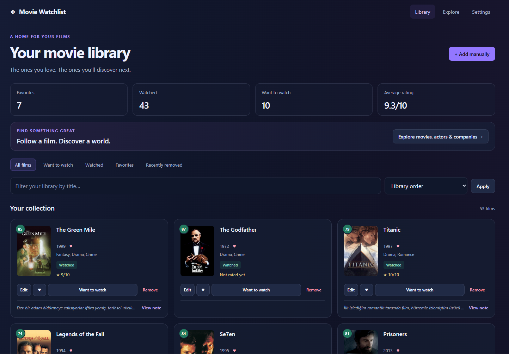
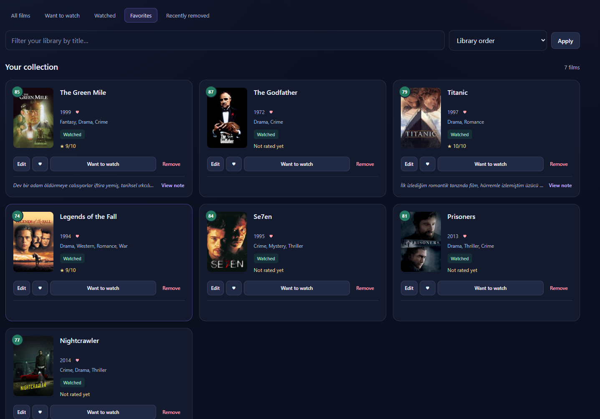
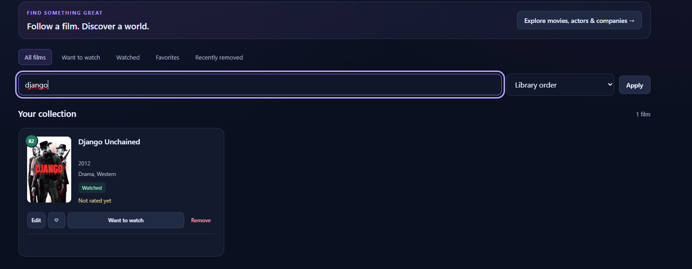
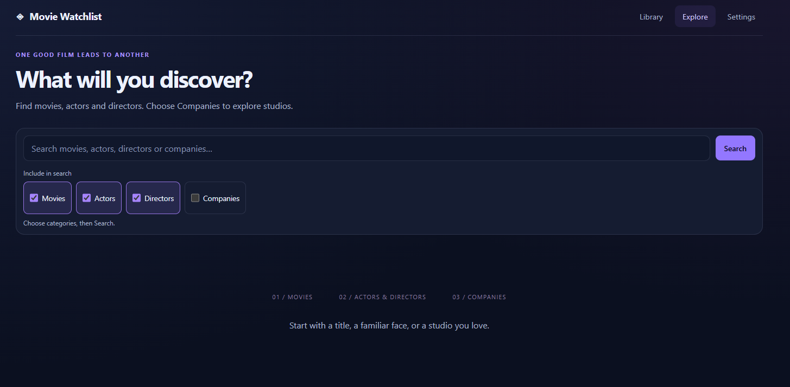
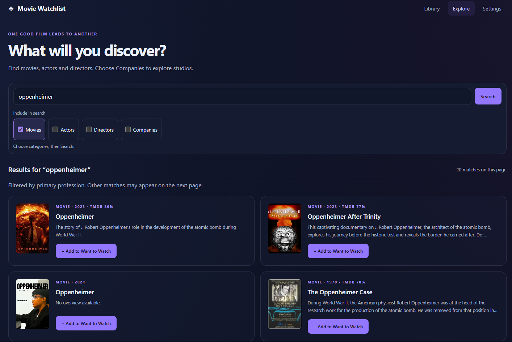
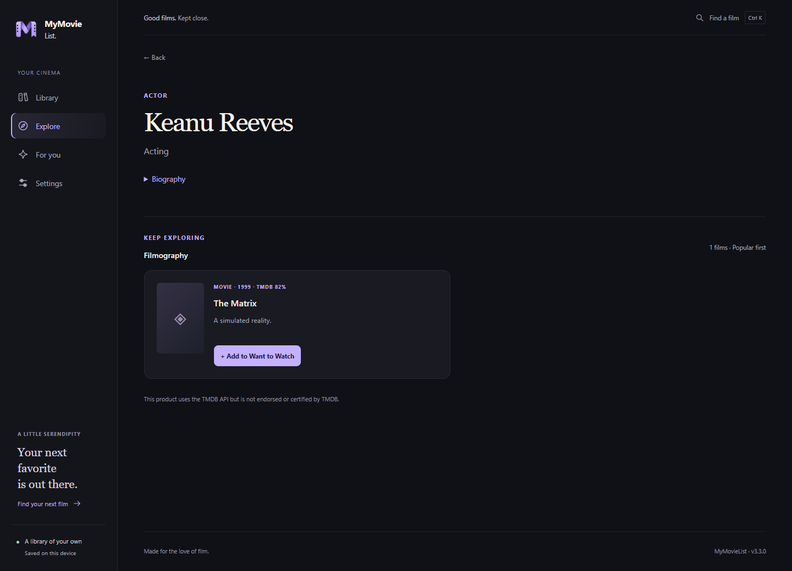
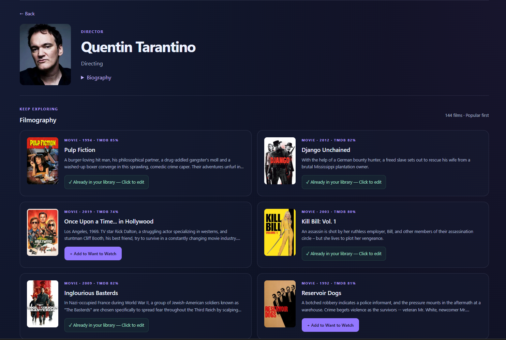
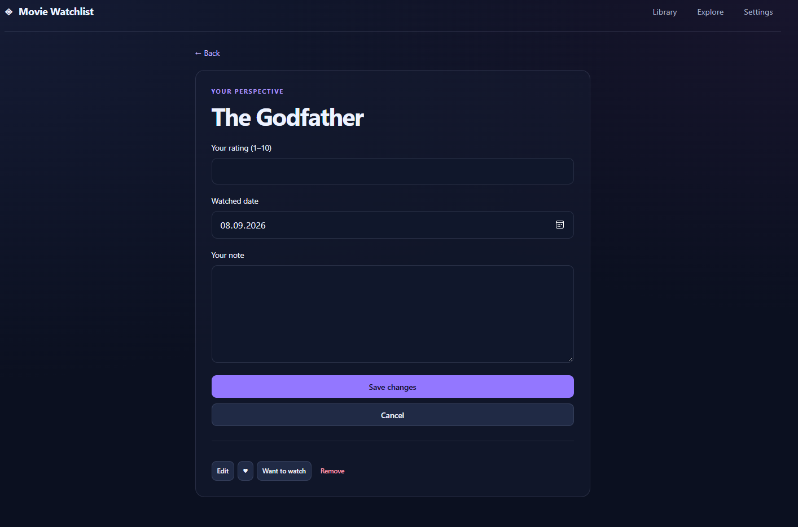

# Movie Watchlist 3.0

A local-first personal film library for Windows and the browser. Flask + Jinja + SQLite, with a small JavaScript interaction layer and a native pywebview window.

Version 3.0 expands the watchlist into a connected movie discovery application: flexible search filters, filmographies, direct library actions, recoverable removal and a more compact interface.

## What's new in 3.0

- **Explore:** one search box with Movies, Actors, Directors and Companies checkboxes. Movies, actors and directors start selected. Suggestions, results and pagination respect the selection; press Search to apply changed filters.
- **One-click collection:** add from search, film details, a person's filmography or a studio's films without leaving the page. Existing entries link to the rating/note editor.
- **Connected discovery:** film → actor/director → filmography and film → studio → films. Writers and producers are also linked from film details, with multiple contributions preserved and duplicate names within a credit group removed.
- **Your library:** favorites independent of watched status, 1–10 ratings, notes, watched dates, title filtering across the entire library, and eleven sort choices.
- **Compact cards:** aligned posters, two-line titles, fixed action rows and a single-line note preview. View note opens the note on the movie detail page; cards never expand. Lazy-loaded posters and 36 films per page.
- **Recoverable removal:** a 10-second Undo notification plus a permanent **Recently removed** view. Restore preserves the original row, metadata and ordering. There is no automatic purge.
- **Keyboard support:** Ctrl/Command+K focuses search. Ctrl/Command+Z triggers the most recent visible Undo when you are not editing text. Standard Tab/Enter controls work throughout.
- **Local storage:** saved film information and downloaded posters remain available offline. If a poster download fails, its online URL is retained; the rest of the movie is still saved.

## Personal recommendations

Open **For you** to get up to ten suggestions, or choose **Choose films you love** for a short, skippable taste survey.

- Start with a varied selection of up to 12 films, including different genres, older films and non-English cinema. Browse another selection or search for a title; your selections remain checked while browsing.
- Pick 3–5 films you enjoyed (up to 24). On **Save picks & continue**, new films enter the library as **Watched**, with no invented rating, favorite or watched date. Existing entries retain their personal data and status. Previously removed entries are restored with their metadata.
- Survey likes are separate from favorites and ratings. Editing your picks changes their recommendation signal without deleting library films. Skipping does not add anything.
- Ratings, favorites and survey likes shape a local genre profile. A single film has limited influence; repeated evidence increases confidence. Related films from the same director count as less independent evidence, and contradictory signals reduce confidence. Low explicit ratings override older survey likes.
- Picks stay in the same order while the app process is running, including page reloads. Restarting the desktop app creates a fresh selection with a local penalty for the previous session's picks. Limited candidate pools may still repeat films. Adding or hiding a film removes it from the current selection, with replacements taken from the same saved order. Editing survey picks explicitly rebuilds the selection; each discovery mode has its own session selection. In browser mode, restarting the local server starts a new recommendation session.
- Choose **Close to my taste**, **A little discovery** or **Surprise me**. Ranking balances genre affinity with variety instead of filling the list with near-identical genres.
- **Why this film?** explains the genre connection without revealing plot details. **Not interested** hides only that film; Undo and **Hidden suggestions → Show again** restore it.
- Existing library entries are excluded from new discoveries. Up to three Want to Watch entries are shown separately as films to consider tonight.

This first version uses genre-level matching, not plot-twist detection, semantic analysis of notes or a trained machine-learning model. It ranks a bounded public TMDB candidate pool locally; taste-derived IDs, notes, ratings and favorites are not sent to TMDB. Explicit title searches and fetching films you choose to add still use TMDB normally. Without enough consistent evidence, the screen labels results as starting suggestions rather than fully personal picks.

## Screenshots

### Your movie library

An overview of your collection, library statistics, ratings and compact movie cards.



<details>
<summary>Favorites and library filtering</summary>

**Favorites**



**Filter your library by title**



</details>

### Search and discovery

Choose which categories to search, then add films directly to your watchlist.



<details>
<summary>Movie search results</summary>



</details>

<details>
<summary>Actor and director filmographies</summary>

**Actor profile**



**Director profile**



</details>

<details>
<summary>Ratings, watched dates and notes</summary>



</details>

## Quick start

1. Open `dist/MovieWatchlist-Discovery.exe` on Windows, or follow the source instructions below.
2. In **Settings**, save your TMDB **API Read Access Token** to enable discovery.
3. Open **Explore**, enter a title or name, choose the categories below the search box, then press **Search**.
4. Use **Add to Want to Watch** on a result or film page. A film already in your library links to its editor instead of creating another entry.
5. Manage watched status, favorites, ratings and notes in **Library**. After removal, use **Undo** or restore the film from **Recently removed**.

### Search filters

There is one search box with independently selectable categories, replacing the previous All/type dropdown:

| Filter | Includes | Selected by default |
| --- | --- | --- |
| Movies | Film title matches | Yes |
| Actors | People primarily known for acting | Yes |
| Directors | People primarily known for directing | Yes |
| Companies | Production company name matches | No |

Uncheck anything you do not want to search. Press **Search** to apply changes to the results; autocomplete uses the selected categories too. Selections stay in the URL, pagination and return links from detail pages. Select at least one category to run a search.

People are labelled by TMDB's primary profession: a director is not labelled as an actor. Writer-only and producer-only primary professions are excluded from search, but their credits and filmographies remain accessible from movie details. Classification follows TMDB's primary profession rather than checking every job a person has ever held.

Autocomplete supports **↑ / ↓**, **Enter** and **Escape**. Movie searches match titles; they do not automatically search the film's cast or director by that title. Follow the credits on the film page to explore those people.

TMDB person results are filtered page by page. Combined and profession-filtered result counts describe the current page, and another page may contain additional matches. Search, remote film details and online posters require an internet connection; locally stored library data does not.

## Run from source

Python 3.12 is tested. On Windows:

```powershell
python -m venv .venv
.\.venv\Scripts\python.exe -m pip install -r requirements.txt
.\.venv\Scripts\python.exe app.py
```

Or use Flask's application factory:

```powershell
.\.venv\Scripts\python.exe -m flask --app app:create_app run
```

Open `http://127.0.0.1:5000`. The app is intended for one user on the local machine, not for public hosting.

## Desktop

The current 3.0 executable is `dist/MovieWatchlist-Discovery.exe`; its filename is retained for existing workflows. The original `dist/MovieWatchlist.exe` is not overwritten. Close the running app before replacing its executable with an updated build.

To build it:

```powershell
.\.venv\Scripts\python.exe -m pip install -r requirements-desktop.txt
.\.venv\Scripts\python.exe -m PyInstaller --noconfirm --onefile --windowed --name MovieWatchlist-Discovery --icon=app_icon.ico --add-data "templates;templates" --add-data "static;static" run_desktop.py
```

The desktop server binds to an available loopback port before opening the window, avoiding fixed-port collisions. Windows needs the Edge WebView2 runtime.

## Data and upgrades

- Source mode: `movies.db` and `posters/` in the project directory.
- Packaged mode: `%APPDATA%\MovieWatchlist\movies.db` and `posters/`.
- `MOVIE_WATCHLIST_DATA_DIR` overrides the data directory (useful for isolated testing).
- Before migrating an existing database, the app creates `movies.db.before-v2-<timestamp>.bak` beside it using SQLite's backup API.
- The application version **3.0** and database schema version **2** are separate: the schema number does not need to match the release name.
- Migrations run in a transaction and never automatically delete duplicate records. If a legacy database contains duplicate TMDB IDs, the migration stops with a diagnostic so they can be reconciled without losing notes.
- New records store creation/update timestamps. Older records keep their IDs and original ordering; their unknown creation dates are not invented.
- Removing a film sets `deleted_at`. Restoring clears it on the same row. Re-adding a removed TMDB movie restores that original entry, including its previous status and personal data.
- Schema 2 adds separate survey-like and hidden-suggestion tables; existing movie columns are preserved.
- A removal marker prevents an old Undo notification from undoing a later deletion.
- The retired `movie_catalog` table is preserved but not used. `import_movies.py` is now a non-destructive compatibility notice.

To restore an entire backup, close the app, keep a copy of the current database, and replace `movies.db` with the chosen backup. Keep `posters/` together with library backups. Do not copy an actively written SQLite database; use SQLite's backup API or close the app first.

## TMDB configuration and privacy

Paste an **API Read Access Token** in Settings, or provide `TMDB_ACCESS_TOKEN` in a `.env` file in the data directory. A saved token takes precedence. Leaving the Settings input blank preserves the current token; removal is explicit.

The token stays on the backend and is stored in the local SQLite database when saved in Settings. It is not encrypted at rest: protect local database backups. No token, personal database or poster directory is included in the desktop build.

Optional `FLASK_SECRET_KEY` keeps session signing stable between launches. Without it, sessions are deliberately invalidated on restart and an old open page may need a refresh.

Writes require a session CSRF token. The app validates local host names, uses same-site cookies, and sends a restrictive content security policy. All TMDB requests use a shared, bounded cache and single-flight request handling. Search results expire after two minutes; detail responses after six hours; ordinary failures after three seconds. Rate-limit responses respect Retry-After and pause further requests. The refresh action invalidates the relevant movie cache.

This product uses the TMDB API but is not endorsed or certified by TMDB.

## Structure

```text
app.py                  Application factory, views, validation and security
storage.py              SQLite transactions, migration, membership and recovery
tmdb_client.py          TMDB requests, cache, error handling and normalization
recommendations.py      Local taste profile, public candidate pool and diverse ranking
recommendation_routes.py Survey, recommendation and feedback routes
run_desktop.py          Native window lifecycle
static/script.js        Shared actions, toasts, autocomplete and library filtering
static/style.css        Responsive design and reduced-motion support
templates/base.html     Shared page shell and navigation
templates/_*.html       Shared result cards, actions, pagination and entity links
tests/                  Isolated library, migration, recommendation and concurrency tests
```

## Development checks

```powershell
.\.venv\Scripts\python.exe -m pip install -r requirements-dev.txt
.\.venv\Scripts\python.exe -m pytest -q
.\.venv\Scripts\ruff.exe check app.py storage.py tmdb_client.py run_desktop.py import_movies.py recommendations.py recommendation_routes.py tests --select F
node --check static/script.js
node --check static/recommendations.js
```

The latest verification passed **40 tests**, covering migration and recovery, duplicate/race handling, request safeguards, caching, discovery navigation, checkbox filtering, autocomplete and pagination. Tests use temporary databases and mocked TMDB responses; they do not modify the personal library. Node.js is only needed for the JavaScript syntax check, not to run the app.

See [QA_RESULTS.md](QA_RESULTS.md) for verification details and testing limitations.
