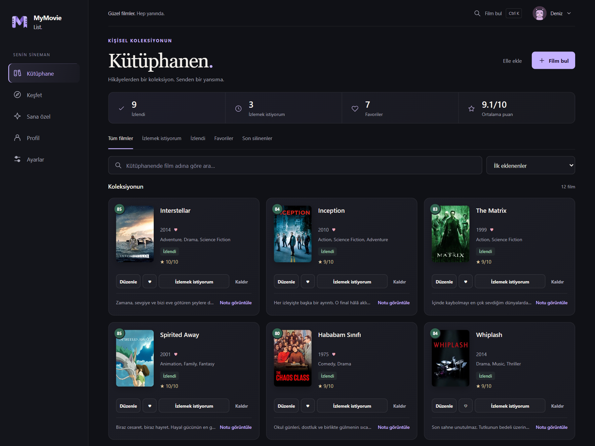
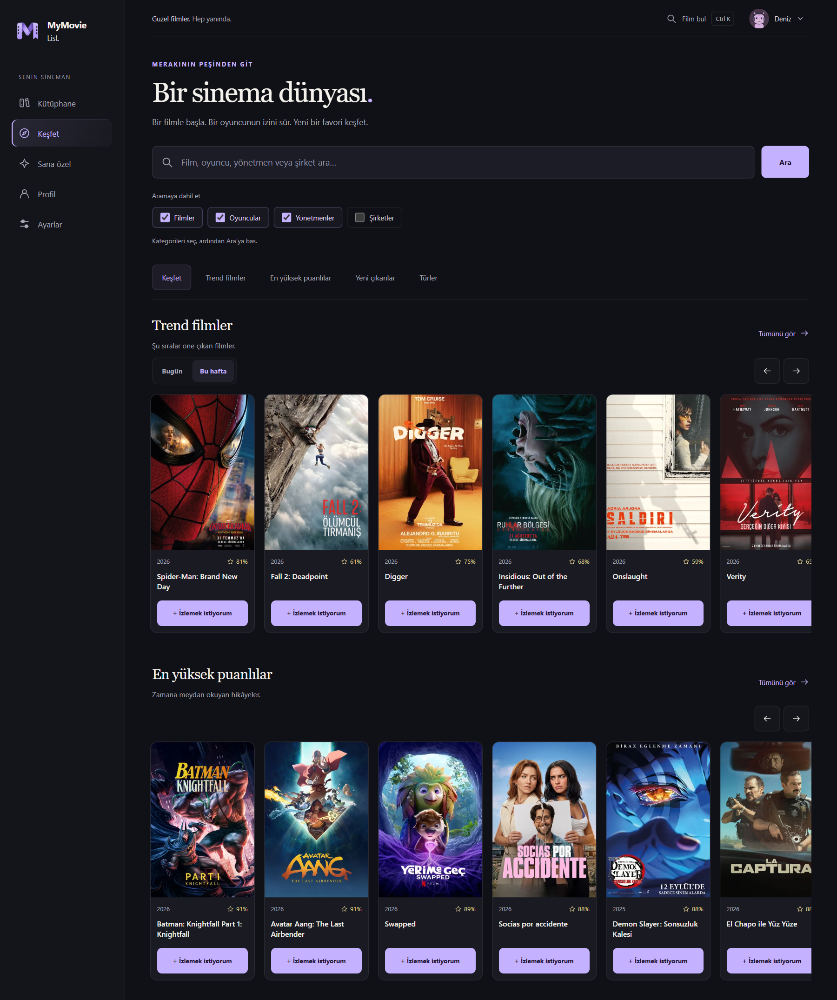
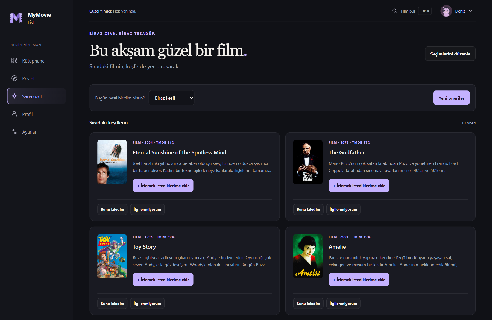
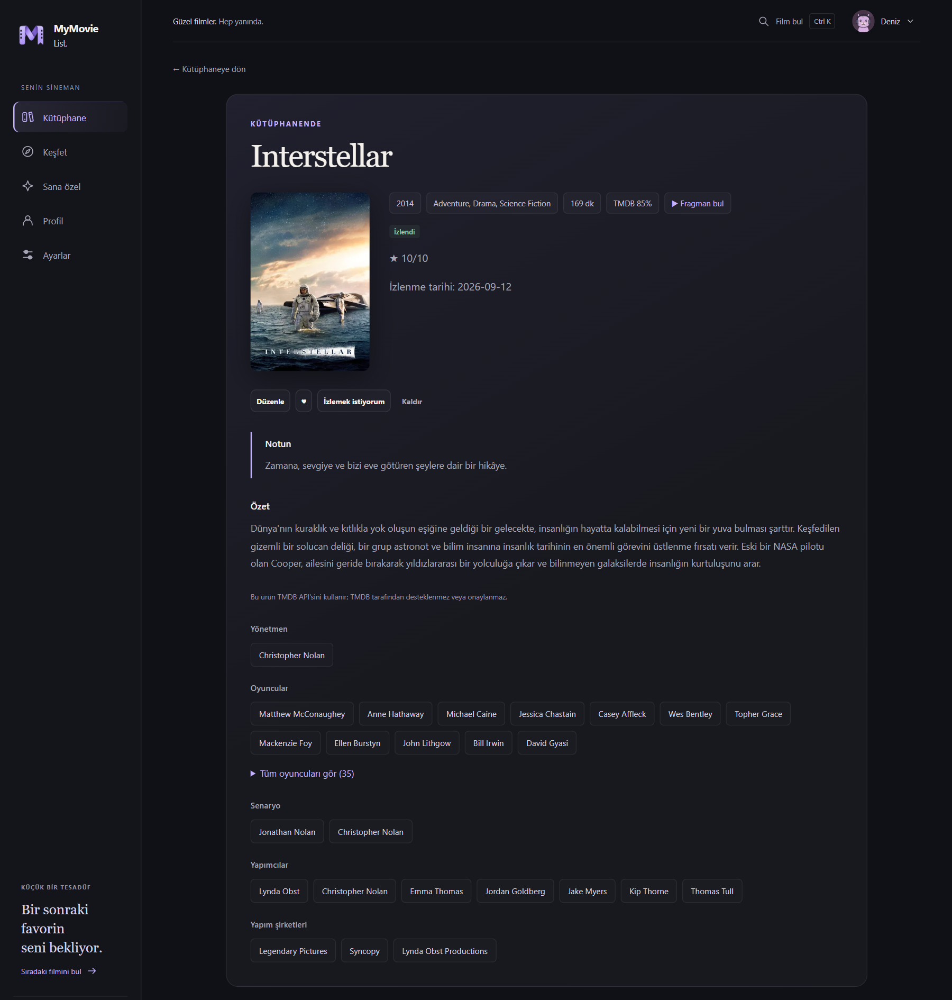
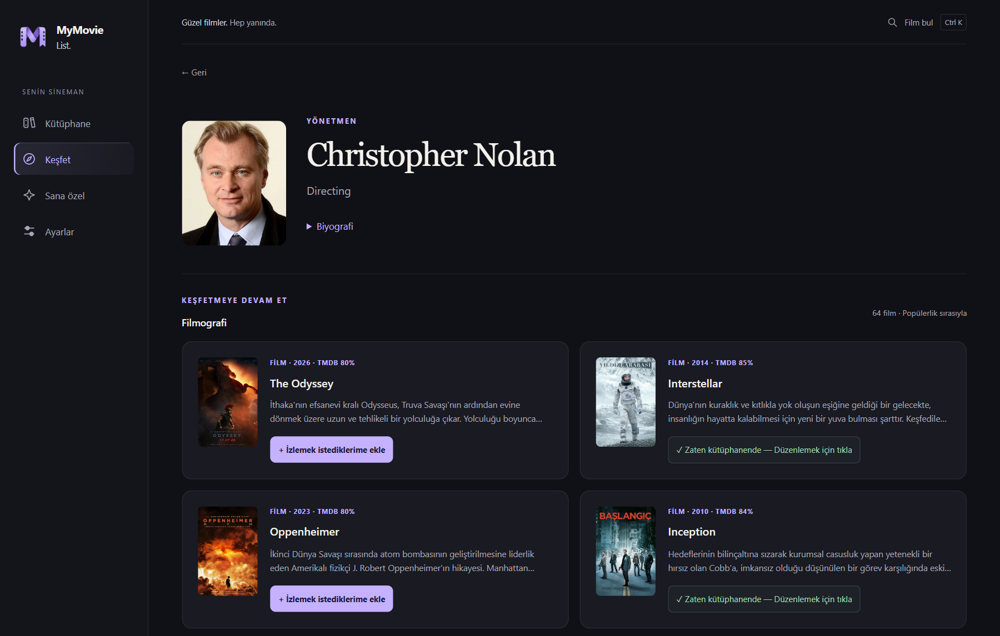
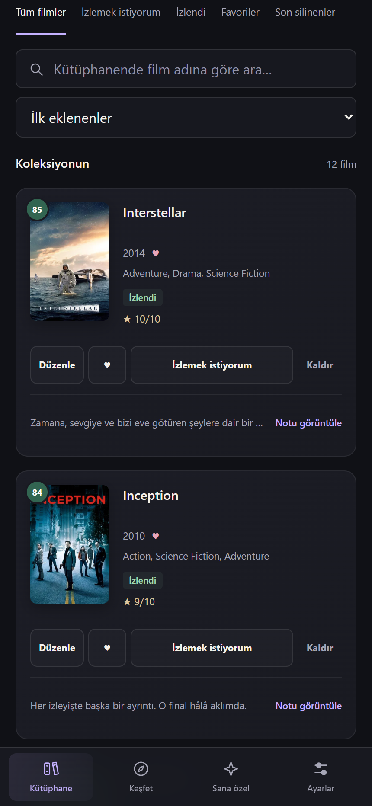
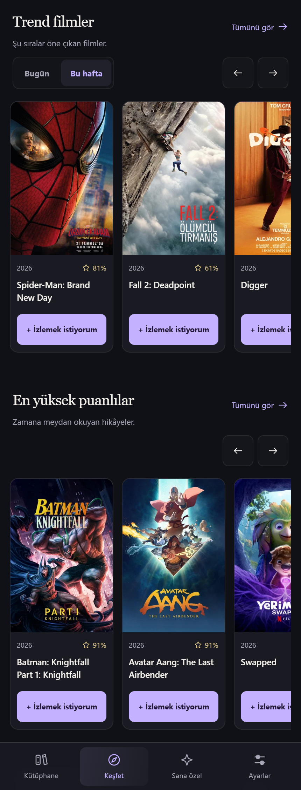

<p align="center">
  
</p>
<h1 align="center">MyMovieList</h1>
<p align="center"><strong>Filmlerin, düşüncelerin, sana ait bir alan.</strong></p>
<p align="center">İzlemek istediklerini biriktir, yeni filmler keşfet, aklında kalanları kendin için yaz. Hesap açman veya API anahtarı ayarlaman gerekmez.</p>
<p align="center"><a href="https://github.com/keremakcn/MyMovieList/releases/latest"><strong>İndir</strong></a> · <a href="https://github.com/keremakcn/MyMovieList/releases">Tüm sürümler</a></p>

[English](README.md) | **Türkçe**

## Başlarken

**Windows — v3.5.0**

1. Sürüm sayfasının **Assets** bölümünden `MyMovieList-v3.5.0-windows.zip` dosyasını indir.
2. Arşivi çıkar ve `MyMovieList-v3.5.0.exe` dosyasını aç. Python kurman gerekmez.
3. Bir film arayıp kütüphanene ekle. Keşif için ek ayar gerekmez.

**Android — 3.5.0-android-beta.1**

**Assets** bölümünden `MyMovieList-3.5.0-android-beta.1.apk` dosyasını indirip telefonunda aç. Android 7.0 veya üzeri, 64 bit ARM cihaz ve güncel Android System WebView gerekir. Android uygulaması kendi başına çalışır, kütüphaneni telefonda saklar ve giriş yaparsan hesap kütüphaneni Windows ile eşitleyebilir. Hesap açmak isteğe bağlıdır. Bu bir beta sürümüdür ve fiziksel cihaz testleri henüz tamamlanmamıştır. [Android ayrıntıları](ANDROID.md).

## Neler yapabilirsin?

- **Türkçe veya İngilizce kullan.** İlk açılışta cihazının arayüz dili esas alınır; Türkçe dışındaki diller için İngilizce kullanılır. Tercihini **Ayarlar → Dil** bölümünden değiştirebilirsin. Türkçe filmler özgün Türkçe adlarıyla gösterilir; özetlerde mevcut Türkçe çeviri, bulunamazsa İngilizce metin kullanılır.
- **Kendi film kütüphaneni oluştur.** İzlediklerini ve izlemek istediklerini takip et; puan, favori ve kişisel not ekle. Kütüphaneni filtrele, sırala ve yanlışlıkla sildiğin bir filmi bilgilerini kaybetmeden geri al.
- **Film ayrıntılarını sakla.** Oyuncular, yönetmenler, senaristler, yapımcılar ve stüdyolar film eklenirken kaydedilir. Eski kayıtların eksik bilgileri çevrimiçi gezinirken tamamlanır; kaydedilen ayrıntılar ve iki dildeki mevcut özetler çevrimdışı da okunabilir.
- **Keşfet.** Günlük veya haftalık trendler, en yüksek puanlı filmler, yeni çıkanlar ve türler arasında gezin. Kütüphanendeki filmleri gizle, afiş kartından doğrudan film ekle; oyuncu, yönetmen ve yapım şirketlerinin diğer filmlerine göz at.
- **Zevkine göre öneriler bul.** Puanların, favorilerin ve sevdiğin film seçimlerin; türler, mevcut temalar, yönetmenler ve başrol oyuncularıyla birlikte değerlendirilir. Üç keşif seçeneği tanıdık tercihlerle yeni ilgi alanlarını farklı oranlarda bir araya getirir. Yeni öneriler istediğinde, seçenekler elverdiği ölçüde yakın zamanda gösterilen filmler ve benzer temalar daha az tekrarlanır.
- **Aradığını hızlıca bul.** Arama sonuçlarından ayrılmadan film ekle. **Ctrl+K** ile aramayı aç; önerilerde ve arayüzde klavyeyle gezinebilirsin.

## Ekran görüntüleri

Görüntüler güncel uygulamadan, örnek bir kütüphane ve herkese açık katalog verileriyle alınmıştır. [İngilizce ekran görüntülerine](README.md#screenshots) de göz atabilirsin.

### Film kütüphanen



### Yeni filmler keşfet



### Sana göre öneriler



<details>
<summary>Film ayrıntıları ve yönetmen sayfası</summary>





</details>

<details>
<summary>Telefon boyutunda görünümler</summary>

Bu görseller, arayüzün dar ekranlara uyarlanan görünümünü gösterir.

<p align="center">
  
  
</p>

</details>

## İsteğe bağlı hesap ve profil

Hesap açmadan kullanmaya devam edebilir veya özel kütüphaneni cihazlar arasında taşımak için giriş yapabilirsin.

- **Otomatik eşitleme:** puanların, notların, favorilerin ve izleme durumun önce cihazına kaydedilir, bağlantı varsa buluta eşitlenir. Eşitle düğmesine basman gerekmez. Eşitlemeyi duraklatabilirsin; bekleyen değişiklikler cihazında kalır.
- **Ayrı kütüphaneler:** giriş yaptığında hesap kütüphanen açılır. Önceki yerel kütüphanen yalnızca sen seçersen hesaba kopyalanır; kendiliğinden yüklenmez.
- **Adım adım kayıt:** e-posta → doğrulama kodu → benzersiz kullanıcı adı → şifre. Normal giriş e-posta ve şifreyle yapılır. Şifre yenilemede önce kod doğrulanır, sonra yeni şifre istenir.
- **Sana ait profil:** görünen isim ve 16 hazır kedi avatarından birini seç. Görünen isimler aynı olabilir. Benzersiz kullanıcı adı bir kez seçilir ve şimdilik değiştirilemez.
- **Vitrinin:** sergilemek istediğin en fazla altı filmi kendin seçip sırala. Paylaşım başlangıçta kapalıdır. Açarsan adresin `myshelf.cloud/u/<kullanıcı_adı>` olur. Yalnızca seçtiğin filmler paylaşılır; puanları ve kütüphane sayaçlarını göstermek de isteğe bağlıdır.
- **Özel notların:** film notların, e-postan, elle eklediğin filmler ve kütüphanenin geri kalanı herkese açık profilde görünmez. İsim kontrolü kişisel film notlarını sansürlemez.

Profiline sol menüden veya üst çubuktan ulaşabilirsin. Masaüstünde içe/dışa aktarma **Ayarlar** bölümünde kalır. Çevrimdışı kullanım, o cihazda kaydedilen verilere dayanır; başka cihazdaki değişiklikleri almak için bağlantı gerekir.

## Düşüncelerin sana ait kalsın

Her filmin ardından yazdıklarını paylaşmak zorunda değilsin. Kütüphanen, notların, puanların ve favorilerin cihazına kaydedilir; keşif servisine veya TMDB’ye yüklenmez. İsteğe bağlı bir hesap kullanırsan hesaba ait kütüphane Supabase üzerinden özel olarak eşitlenir. İlk yerel kütüphanen bu hesaba yalnızca sen seçersen kopyalanır. Öneri sıralaması cihazında yapılır; kişisel notların analiz edilmez.

Aramalar ve film kataloğu istekleri `api.myshelf.cloud` üzerinden TMDB’ye iletilir. Keşif ve uzak görseller için internet gerekir; kaydedilmiş film bilgileri ve indirilmiş afişler çevrimdışı kullanılabilir. Önerilerde kullanılan herkese açık film havuzu cihazında önbelleğe alınır; çevrimdışı sonuçlar bu havuzdaki verilere bağlıdır. Uygulama yerel verileri ayrıca şifrelemez.

**Windows güncellemeleri kütüphaneni korur.** EXE dosyasını değiştirmeden önce uygulamayı kapat. Verilerin `%APPDATA%\MovieWatchlist` içinde kalır; eski klasör adı uyumluluk için korunur. Android’de veriler uygulamanın özel depolama alanında tutulur ve aynı imzalı sürümle yapılan normal güncellemede korunur. Uygulamayı kaldırmak veya depolama alanını temizlemek telefondaki kütüphaneyi siler. Hesapla eşitleme kullanılmıyorsa cihaz kütüphaneleri birbirinden bağımsızdır.

## Kaynak koddan çalıştırma

Python 3.12 önerilir. Windows’ta proje klasöründen:

```powershell
python -m venv .venv
.\.venv\Scripts\python -m pip install -r requirements-desktop.txt
.\.venv\Scripts\python run_desktop.py
```

Geliştirme ayrıntıları için [sürüm notları](RELEASE_NOTES.md), [test sonuçları](QA_RESULTS.md), [Android derleme yönergeleri](ANDROID.md) ve [keşif servisi kurulumu](cloudflare/watchlist-api/README.md) belgelerine bakabilirsin.

Geliştiriciler için: [bulut kurulumu](supabase/README.md) ve [veri taşıma tasarımı](CLOUD_SYNC_DESIGN.md). Hesap hizmetinin tamamı için 001–004 veritabanı dosyaları kurulmalıdır.


## Teşekkürler

Film verileri ve görseller [TMDB](https://www.themoviedb.org) tarafından sağlanır. Bu ürün TMDB API’sini kullanır ancak TMDB tarafından onaylanmış veya sertifikalandırılmış değildir.
