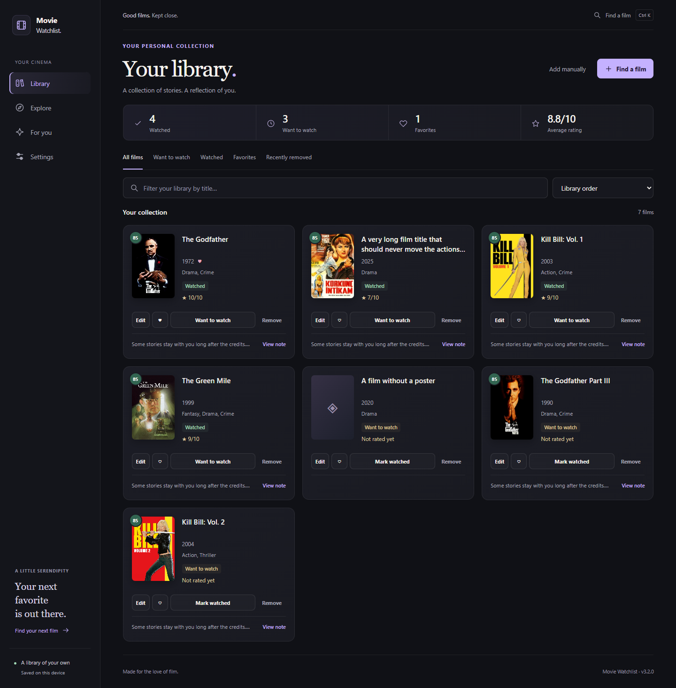
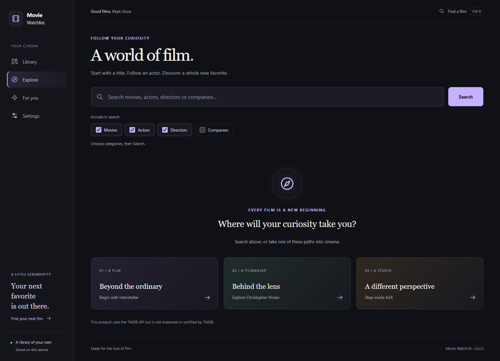

# Movie Watchlist v3.2.0 — UI Design and Verification

The redesigned interface is part of the main Movie Watchlist release.

## Start the application

Open `dist/MovieWatchlist-v3.2.0.exe`, or extract and open the executable from the release ZIP.

The Windows release uses the existing `%APPDATA%\MovieWatchlist` library, posters and configuration. It does not read the earlier frontend preview's adjacent `data/` folder. An explicit `MOVIE_WATCHLIST_DATA_DIR` environment setting still overrides the default.

To run from source, install the desktop requirements into a virtual environment and run `run_desktop.py`. Source mode uses the database in the project folder unless the data directory is explicitly overridden.

## Design

- A quiet charcoal palette, lavender accents, editorial headings and locally rendered SVG icons.
- Desktop navigation and the compact tablet rail scroll with the page and extend to its full height; mobile bottom navigation stays fixed.
- A shorter library overview, compact statistics and a primary Find a film action.
- Consistent fixed-note library cards; full notes open on the detail page.
- A new Explore landing page with film, filmmaker and studio starting points.
- Recommendation controls grouped together; changing discovery mode applies immediately.
- Refined film detail, entity, form, onboarding, empty and loading states.
- Shared CSS tokens and component rules replace the old stylesheet.

## Interaction corrections

- Restore keyboard focus after library removal and after a filtered quick action removes its card.
- Hide the entire edit form when its film is removed; Undo restores it.
- Keep focus predictable when removing taste selections or adding recommendations.
- Retry the actual failed taste-search page instead of restarting at page one.
- Remove redundant Apply buttons when automatic JavaScript controls are available; native forms still work without JavaScript.

## Verification

- 48 automated tests passed against isolated databases, including packaged-launcher data-path and library-preservation checks.
- JavaScript syntax and Ruff F checks passed.
- Headless Edge checked library, Explore, results, recommendations, onboarding, detail, edit, settings, actor and company pages.
- Responsive checks at 320, 390, 768 and 1024 CSS pixels found no horizontal document overflow in the tested flows.
- Checked equal closed-card heights, a long title, a missing poster, removal/Undo, edit removal, survey focus and keyboard autocomplete.
- No JavaScript errors in those browser scenarios.
- Fixture tests do not assess live TMDB availability, screen-reader compatibility or every Windows display configuration.

Screenshots below use isolated example data.





## Repeat the browser checks

Install Playwright in your testing environment. Start `python tests/frontend_fixture_server.py`, then run `node tests/frontend.e2e.cjs` in another terminal. The server uses an isolated database under `.qa/frontend-fixture/` with mocked TMDB responses. It does not modify the project library.

Optional environment variables: `PLAYWRIGHT_MODULE` for a custom Playwright module path, `EDGE_PATH` for an existing Edge executable, and `PREVIEW_URL` for another fixture server address.

## Build

```powershell
.\scripts\build_release.ps1
```

No change to the recommendation algorithm or database schema is included in this design work.
